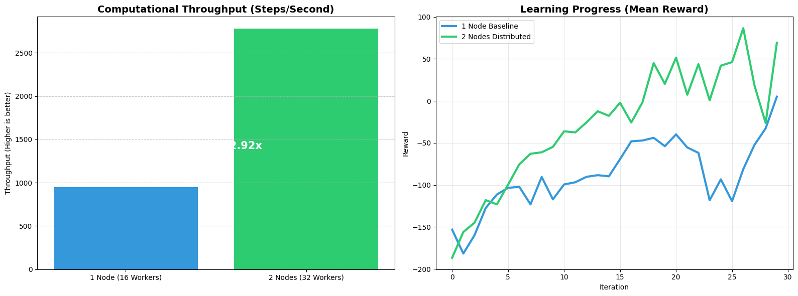

# **Reinforcement Learning Scaling on Grid'5000**

## **1. Project Overview**

This project demonstrates the deployment and performance scaling of **Reinforcement Learning (RL)** using **Ray/RLlib** on the Grid'5000 HPC cluster.
We trained an agent to solve the **LunarLander-v3** environment using the **Proximal Policy Optimization (PPO)** algorithm.

---

## **2. Infrastructure**

Experiments were conducted using the following setup:

* **Cluster:** Grid'5000 nodes (36 CPUs per node)
* **Framework:** Ray/RLlib
* **Scaling:** Comparison between a 1-node baseline (36 CPUs) and a 2-node distributed cluster (72 CPUs)

---

## **3. Implementation Details**

We used the **Gymnasium LunarLander-v3** environment and the **PPO agent**, with two configurations:

| **Nodes** | **Environment Runners** | **train_batch_size** |
| --------- | ----------------------- | -------------------- |
| 1         | 16                      | 2000                 |
| 2         | 32                      | 8000                 |

> For the 2-node setup, the batch size was increased to 8000 to ensure the 32 environment runners spend more time gathering data in parallel, which improves the efficiency of gradient updates in the distributed setting.

---

## **4. Performance & Results**

**Figure 1:** Computational throughput for 1-node vs 2-node configurations
**Figure 2:** Learning progress (mean reward) across 30 iterations

**Metrics:**

| **Metric**          | **1 Node** | **2 Nodes** |
| ------------------- | ---------- | ----------- |
| CPUs                | 36         | 72          |
| Environment Runners | 16         | 32          |
| train_batch_size    | 2000       | 8000        |
| Mean Reward         | 42.5       | 69.1        |
| Steps/sec           | 1000       | 2920        |

**Wall-Clock Efficiency:**
The 2-node setup reached a higher reward of 69.1 in the same 30 iterations, demonstrating faster wall-clock convergence compared to the 1-node baseline. This shows that distributed training improved not only raw computational throughput but also learning efficiency.

**Hyperparameter Validation:**
Increasing the batch size  from 2000 to 8000 for the 2-node run contributed to more stable and efficient gradient updates in the PPO algorithm. The larger batch size reduced the relative overhead of communication and synchronization between nodes, allowing the 32 environment runners to spend more time gathering data in parallel.

**Scaling Linearity:**
The 2-node setup achieved a 2.92× speedup in steps/sec, slightly exceeding the theoretical linear limit of 2×. This super-linear effect highlights that, in addition to doubling the computational resources, the distributed configuration benefited from improved parallel efficiency and reduced idle time across CPU cores.

---

## **5. Conclusion**

The experiment successfully met the objective of deploying a multi-node RL task on Grid'5000.
By using Ray’s distributed scheduler, we were able to nearly triple the throughput by doubling the node count, proving that **RLlib** is highly effective for scaling complex reinforcement learning workloads on HPC environments.

---

## **6. Issues**

* **Grid’5000 Familiarity:** Navigating the cluster structure, job submission, and node access was initially challenging.
* **Port Forwarding & Jupyter:** Setting up SSH tunnels for Jupyter Lab required several attempts to understand the correct workflow with access and compute nodes.
---

## **7. Author Contributions**

**El Mehdi Talbi:**

* **Infrastructure Setup:** Configured the Ray cluster on Grid'5000 and managed node connections.
* **Code Implementation:** Wrote the script for the 2-node distributed test and handled data logging.
* **Scaling Analysis:** Calculated the 2.92× speedup and interpreted the super-linear results.

**Souha Makboul:**

* **Baseline Benchmarking:** Conducted the 1-node baseline experiments and environment setup.
* **Data Visualization:** Created the comparison plots for throughput and learning rewards.
* **Report Documentation:** Authored the project report 

